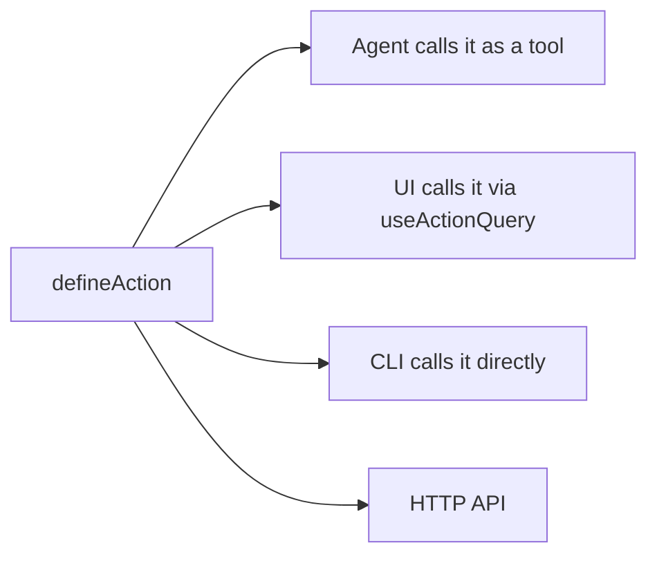

# Docs components

The docs site renders standard Markdown plus a set of MDX block components for
richer content. Each section below shows a live rendered example followed by
the exact MDX syntax that produced it.

---

## Callout

<Callout tone="info">

This is an `info` callout. Use it for background context or neutral notes. You can use **bold**, `inline code`, and [links](/docs/getting-started) inside.

</Callout>

<Callout tone="warning">

This is a `warning` callout. Use it for potential data loss, breaking changes, or hard-to-reverse steps. For example: restart `pnpm dev` after adding a new route file — the router only picks up files present at startup.

</Callout>

<Callout tone="success">

This is a `success` callout. Use it for the recommended path or to confirm a working approach.

</Callout>

<Callout tone="risk">

This is a `risk` callout. Use it for security implications or production caveats.

</Callout>

<Callout tone="decision">

This is a `decision` callout. Use it to surface a deliberate tradeoff the reader should understand.

</Callout>

```mdx
<Callout tone="info">

This is an `info` callout. Use it for background context or neutral notes. You can use **bold**, `inline code`, and [links](/docs/getting-started) inside.

</Callout>

<Callout tone="warning">

This is a `warning` callout. Use it for potential data loss, breaking changes, or hard-to-reverse steps. For example: restart `pnpm dev` after adding a new route file — the router only picks up files present at startup.

</Callout>

<Callout tone="success">

This is a `success` callout. Use it for the recommended path or to confirm a working approach.

</Callout>

<Callout tone="risk">

This is a `risk` callout. Use it for security implications or production caveats.

</Callout>

<Callout tone="decision">

This is a `decision` callout. Use it to surface a deliberate tradeoff the reader should understand.

</Callout>
```

| Tone       | When to use                                                  |
| ---------- | ------------------------------------------------------------ |
| `info`     | Background context, neutral notes                            |
| `warning`  | Potential data loss, breaking changes, hard-to-reverse steps |
| `success`  | Recommended option, confirmed working path                   |
| `risk`     | Security implications, production caveats                    |
| `decision` | Deliberate tradeoffs the reader should understand            |

Leave a blank line between the opening tag and the body, and another before the closing tag.

---

## Steps

<Steps>

### Install dependencies

Run the following inside your project directory:

```bash
pnpm install
```

### Start the dev server

```bash
pnpm dev
```

Open `http://localhost:3000`. The app is ready when **VITE ready** appears in the terminal.

### Sign in

The first run shows a login screen. Use any credentials — local development does not send email.

</Steps>

````mdx
<Steps>

### Install dependencies

Run the following inside your project directory:

```bash
pnpm install
```

### Start the dev server

```bash
pnpm dev
```

Open `http://localhost:3000`. The app is ready when **VITE ready** appears in the terminal.

### Sign in

The first run shows a login screen. Use any credentials — local development does not send email.

</Steps>
````

Each step is a `###` heading followed by the body content. Steps work best for 3–8 items. For 2 items a numbered list is fine. For longer procedures, split into multiple `<Steps>` blocks with a prose bridge between them.

---

## Cards

<Cards>

### [Actions](/docs/actions)

Typed operations callable from the agent, UI, CLI, and HTTP. Define once, call from anywhere.

### [Database](/docs/database)

SQL persistence with automatic migrations. SQLite locally, Postgres/Turso in production.

### [Agent Surfaces](/docs/agent-surfaces)

Configure where the agent appears: full-page chat, sidebar panel, or embedded in a route.

### Skills

Plain-text instruction files that give the agent domain knowledge and task-specific behavior without code changes.

</Cards>

```mdx
<Cards>

### [Actions](/docs/actions)

Typed operations callable from the agent, UI, CLI, and HTTP. Define once, call from anywhere.

### [Database](/docs/database)

SQL persistence with automatic migrations. SQLite locally, Postgres/Turso in production.

### [Agent Surfaces](/docs/agent-surfaces)

Configure where the agent appears: full-page chat, sidebar panel, or embedded in a route.

### Skills

Plain-text instruction files that give the agent domain knowledge and task-specific behavior without code changes.

</Cards>
```

Each card is a `###` heading (optionally linked) followed by the description. Cards without a link render as plain info boxes with no hover state or arrow.

---

## Notice

<Notice tone="risk" title="Bold, not subtle">

Use `Notice` when a `Callout` would be too easy to skim past — something the reader must not miss, like a destructive action or a hard requirement. It shares the same five tones as `Callout` (`info`, `decision`, `risk`, `warning`, `success`) but renders as a filled card with an icon and optional title instead of a left-border note.

</Notice>

```mdx
<Notice tone="risk" title="Bold, not subtle">

Use `Notice` when a `Callout` would be too easy to skim past — something the reader must not miss, like a destructive action or a hard requirement.

</Notice>
```

`title` is optional — omit it for a shorter card with just the icon and body. Leave a blank line between the opening tag and the body, same as `Callout`. Reach for `Callout` first; use `Notice` only when a subtle left-border note isn't enough attention.

---

## Banner

<Banner
  tone="warning"
  body="This page describes the v9 API. See [Migrating to v10](/docs/migrating-v10) for what changed."
/>

```mdx
<Banner
  tone="warning"
  body="This page describes the v9 API. See [Migrating to v10](/docs/migrating-v10) for what changed."
/>
```

`Banner` is self-closing — `body` is a flat attribute (kept short and single-purpose on purpose), not markdown children. Place it right under a page's title or a section heading — deprecated, beta, moved, version-scoped. For content the reader needs to actually read (not just notice), use `Notice` or `Callout` instead.

---

## Accordion

<Accordion>

### Do I need Toolkit to use Core?

No. Toolkit is optional shared UI — Core works standalone.

### Can I mix Templates and Toolkit?

Yes, most first-party templates already do.

### Where do I ask questions?

The `#agent-native` Discord channel, linked in the site header.

</Accordion>

```mdx
<Accordion>

### Do I need Toolkit to use Core?

No. Toolkit is optional shared UI — Core works standalone.

### Can I mix Templates and Toolkit?

Yes, most first-party templates already do.

</Accordion>
```

Same authoring shape as `Steps`/`Cards` — a `### Question` heading per item followed by its answer — but each item renders collapsed behind native `<details>`. Best for FAQ-style content where most readers only need one or two entries, not a full top-to-bottom read.

---

## Badge

<Badge label="Beta" color="orange" icon="rocket" />

<Badge label="Deprecated" color="red" />

<Badge label="v9.1+" color="blue" shape="pill" />

<Badge label="Server-only" color="gray" stroke />

```mdx
<Badge label="Beta" color="orange" icon="rocket" />

<Badge label="Deprecated" color="red" />

<Badge label="v9.1+" color="blue" shape="pill" />

<Badge label="Server-only" color="gray" stroke />
```

A small status chip for the top of a page or section. Self-closing, block-level only — **not** embeddable mid-sentence (the docs MDX pipeline only recognizes a custom component when its tag opens its own line, so `text <Badge label="x"/> more text` renders as literal text, not a chip). Place it on its own line, typically right after a heading. Leave a blank line between adjacent Badges (or any two block components) — without one, the scanner can't tell where one ends and the next begins and falls back to rendering literal text.

| Prop       | Values                                                                                                                                                 |
| ---------- | ------------------------------------------------------------------------------------------------------------------------------------------------------ |
| `color`    | `gray` · `blue` · `green` · `yellow` · `orange` · `red` · `purple` · `white` · `surface` · `white-destructive` · `surface-destructive`                 |
| `size`     | `xs` · `sm` · `md` · `lg`                                                                                                                              |
| `shape`    | `rounded` (default) · `pill`                                                                                                                           |
| `icon`     | one of a curated set — `circle-check`, `circle-info`, `alert-triangle`, `alert-octagon`, `ban`, `clock`, `star`, `flame`, `sparkles`, `lock`, `rocket` |
| `stroke`   | `true` for an outlined, transparent-background variant                                                                                                 |
| `disabled` | `true` to dim it for an inactive/unavailable state                                                                                                     |

---

## Comparison

<Comparison>

### Before

Every feature needs a separate API endpoint, a separate React query, and manual wiring between the AI response and UI state.

### After

Define one action. The agent calls it as a tool, the UI calls it through a React hook, and both read the same validated output.

</Comparison>

```mdx
<Comparison>

### Before

Every feature needs a separate API endpoint, a separate React query, and manual wiring between the AI response and UI state.

### After

Define one action. The agent calls it as a tool, the UI calls it through a React hook, and both read the same validated output.

</Comparison>
```

Add more `###` sections to get 3 or 4 columns (max 4). The red/green label accent only applies to headings that exactly match `Before`, `Old`, `Without` (red) or `After`, `New`, `With` (green).

---

## kbd — keyboard shortcut

Press [[⌘K]] to open the command palette. Save with [[Ctrl+S]] before running the dev server. Navigate fields with [[Tab]] and [[Shift+Tab]].

```mdx
Press [[⌘K]] to open the command palette. Save with [[Ctrl+S]] before running the dev server. Navigate fields with [[Tab]] and [[Shift+Tab]].
```

Double brackets around the key sequence; no MDX component needed. Works anywhere in regular Markdown paragraphs.

---

## Mermaid diagram



````mdx

````

Use a fenced code block with the `mermaid` language tag. Mermaid supports flowcharts (`graph`), sequence diagrams (`sequenceDiagram`), entity-relationship diagrams (`erDiagram`), and more. See [mermaid.js.org](https://mermaid.js.org/intro/) for the full syntax reference.

---

## FileTree

<FileTree
  id="docs-components-filetree"
  entries={[
    {
      path: "actions/analyze-text.ts",
      change: "added",
      note: "New action — callable from agent, UI, and CLI",
    },
    { path: "actions/list-text-analyses.ts", change: "added" },
    { path: "app/routes/analyses.tsx", change: "modified" },
    {
      path: "app/config/nav.ts",
      change: "modified",
      note: "Add the new route to the sidebar nav",
    },
    { path: "db/migrations/001_analyses.sql" },
  ]}
/>

```mdx
<FileTree
  id="docs-components-filetree"
  entries={[
    {
      path: "actions/analyze-text.ts",
      change: "added",
      note: "New action — callable from agent, UI, and CLI",
    },
    { path: "actions/list-text-analyses.ts", change: "added" },
    { path: "app/routes/analyses.tsx", change: "modified" },
    {
      path: "app/config/nav.ts",
      change: "modified",
      note: "Add the new route to the sidebar nav",
    },
    { path: "db/migrations/001_analyses.sql" },
  ]}
/>
```

FileTree is **self-closing** (`/>`). It does not accept Markdown children — if you use open/close tags with content inside you will get a parse error.

Each entry in `entries` is an object with a `path` key (slash-delimited) and optional fields:

| Field      | Values                                                  | Effect                               |
| ---------- | ------------------------------------------------------- | ------------------------------------ |
| `change`   | `"added"` \| `"modified"` \| `"removed"` \| `"renamed"` | Colored badge on the row             |
| `note`     | any string                                              | Expandable annotation shown on hover |
| `snippet`  | code string                                             | Expandable code preview              |
| `language` | e.g. `"ts"`                                             | Syntax highlighting for the snippet  |

---

## Tabs

<TabsBlock
  id="docs-components-tabs"
  tabs={[
    {
      id: "pnpm",
      label: "pnpm",
      blocks: [
        {
          type: "code",
          id: "pnpm-install",
          data: { code: "pnpm install", language: "bash" },
        },
      ],
    },
    {
      id: "npm",
      label: "npm",
      blocks: [
        {
          type: "code",
          id: "npm-install",
          data: { code: "npm install", language: "bash" },
        },
      ],
    },
    {
      id: "yarn",
      label: "yarn",
      blocks: [
        {
          type: "code",
          id: "yarn-install",
          data: { code: "yarn install", language: "bash" },
        },
      ],
    },
  ]}
/>

```mdx
<TabsBlock
  id="docs-components-tabs"
  tabs={[
    {
      id: "pnpm",
      label: "pnpm",
      blocks: [
        {
          type: "code",
          id: "pnpm-install",
          data: { code: "pnpm install", language: "bash" },
        },
      ],
    },
    {
      id: "npm",
      label: "npm",
      blocks: [
        {
          type: "code",
          id: "npm-install",
          data: { code: "npm install", language: "bash" },
        },
      ],
    },
    {
      id: "yarn",
      label: "yarn",
      blocks: [
        {
          type: "code",
          id: "yarn-install",
          data: { code: "yarn install", language: "bash" },
        },
      ],
    },
  ]}
/>
```

`TabsBlock` is self-closing. The entire structure is one JSON `tabs` attribute. Each tab's content is a `blocks` array where each item is a block object with `type`, `id`, and `data` matching that block's schema. Tabs works best for short parallel code snippets (one code block per tab). For richer multi-block content per tab, use a visual editor rather than hand-authoring the JSON.

---

## Columns

<Columns
  id="docs-components-columns"
  columns={[
    {
      id: "col-manual",
      label: "Manual approach",
      blocks: [
        {
          type: "code",
          id: "manual-code",
          data: {
            code: "const res = await fetch('/api/analyses')\nconst data = await res.json()",
            language: "ts",
          },
        },
      ],
    },
    {
      id: "col-actions",
      label: "With actions",
      blocks: [
        {
          type: "code",
          id: "action-code",
          data: {
            code: "const { data } = useActionQuery('list-text-analyses', {})",
            language: "ts",
          },
        },
      ],
    },
  ]}
/>

```mdx
<Columns
  id="docs-components-columns"
  columns={[
    {
      id: "col-manual",
      label: "Manual approach",
      blocks: [
        {
          type: "code",
          id: "manual-code",
          data: {
            code: "const res = await fetch('/api/analyses')\nconst data = await res.json()",
            language: "ts",
          },
        },
      ],
    },
    {
      id: "col-actions",
      label: "With actions",
      blocks: [
        {
          type: "code",
          id: "action-code",
          data: {
            code: "const { data } = useActionQuery('list-text-analyses', {})",
            language: "ts",
          },
        },
      ],
    },
  ]}
/>
```

Like `TabsBlock`, `Columns` is self-closing with a single JSON `columns` attribute. Each column has an optional `label` header and a `blocks` array. For comparing prose rather than code, `Comparison` is easier to hand-author.

---

## When to use which component

| Situation                                             | Component                            |
| ----------------------------------------------------- | ------------------------------------ |
| Reader must not miss something, inline in prose       | `Callout` (warning / info / success) |
| Reader must not miss something, standalone            | `Notice`                             |
| Deprecated/beta/version notice at page or section top | `Banner`                             |
| Status or version tag at page or section top          | `Badge`                              |
| Sequential procedure with titled steps                | `Steps`                              |
| FAQ-style content, one answer at a time               | `Accordion`                          |
| Navigation or feature overview grid                   | `Cards`                              |
| Before vs. after, old vs. new (prose)                 | `Comparison`                         |
| Same task in multiple tools or frameworks             | `Tabs`                               |
| Side-by-side code (labeled columns)                   | `Columns`                            |
| Project directory structure                           | `FileTree`                           |
| Inline keyboard shortcut                              | `[[Key]]`                            |
| Architecture or flow diagram                          | Mermaid fence                        |
