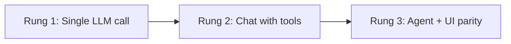
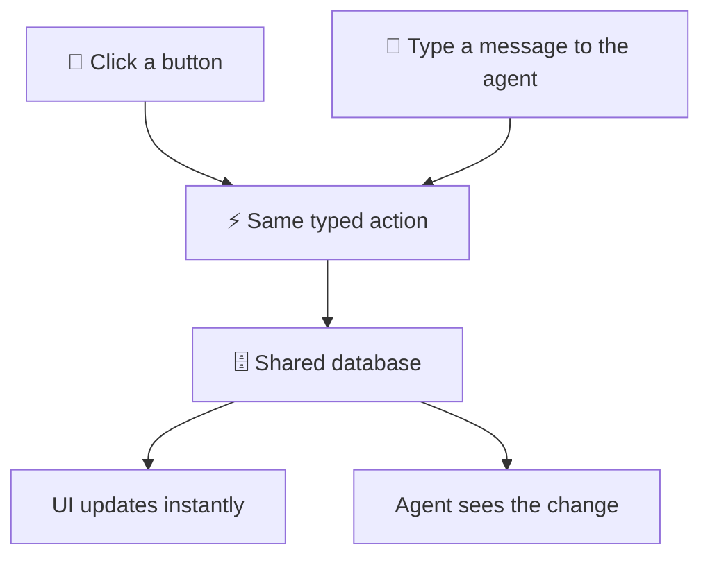

# What Is Agent-Native?

Most "AI features" today are a chat box bolted onto an existing product. You can ask questions and get summaries, but you can't ask the AI to actually _do_ anything in the app — and even when you can, the UI has no idea what the agent just did.

Agent-native is the fix. It's a way of building software where **the AI agent and the UI are equal partners** — they share the same actions, the same database, and the same state. Everything the agent can do is also a button. Everything the user clicks is also something the agent can do. One system, two ways in.

<Callout tone="decision">

If you only remember one thing from this page: most AI apps stop one step short of being useful — and that gap is the biggest mistake in the space right now.

</Callout>

## What it looks like as a user {#what-it-looks-like}

Picture a mail client, analytics dashboard, or project tracker. Chat might be the first screen — or docked on the side of a full app. Either way:

<Cards>

### Just ask

Type "reply to the email from Sara saying I'll be there by 3." The agent opens the thread, drafts the reply, and shows it to you for approval.

### Or click

Every button, list, form, and keyboard shortcut still works — and calls the same operation the agent uses.

### See what it sees

Open an email and the agent knows which one. Highlight a paragraph and press `Cmd+I` — the agent acts on exactly that.

### Watch it work

The UI updates in real time as the agent opens views, edits drafts, and runs reports. Interrupt, redirect, or take over with the mouse at any moment.

### Steer it like a teammate

Give feedback, queue tasks, audit what it did, edit its instructions. It remembers, and it improves.

</Cards>

Here's why most products don't get there.

## Why most "AI apps" fall short {#the-ladder}

There's a progression most teams climb, and most stop one rung too early.



**Rung 1** — A text box sends a prompt, the AI returns a string. No way to course-correct, no persistence, no audit trail. This is what most "AI features" actually are: a Summarize button bolted onto a SaaS product. Impressive in demos, breaks in production.

**Rung 2** — The AI has tools and a chat interface. Claude, ChatGPT, and Cursor all look like this under the hood. Real step up — but it's still a chat window. No dashboards, no forms, no collaboration. Non-developers struggle to get real work done here.

**Rung 3** — Every agent action is also a button; every button runs the same logic the agent uses. The agent has real context (it sees what you're looking at and writes to the same database), and external agents can call it too over A2A and MCP.

<Callout tone="success">

**Rung 3 is agent-native.** You stopped adding buttons to a chatbot. You added an agent to an app. That's a much higher-quality product on both sides.

</Callout>

See [Key Concepts — Protocols](/docs/key-concepts#protocols) for how all of this hangs off the same action definition.

## How agent and UI share the same actions {#agent-ui-parity}

In a normal app, the UI and any "AI features" live in separate worlds — the buttons call one set of code, the AI calls another. Agent-native collapses that into one.

Every operation is defined as a typed **action**: a name, a schema, and a `run` function. The agent calls those actions as tools. The UI calls the same actions when a button is clicked. There's no translation layer, no duplication, and no drift.



The diagram above shows what this looks like at runtime: both the user and the agent submit actions to the same layer, which writes to the same database and broadcasts updates back to both surfaces. When the agent creates a draft email, it appears in your inbox immediately. When you click Send, the agent knows it was sent. See [Key Concepts](/docs/key-concepts) for the full architecture.

## Why agents need a UI — and apps need an agent {#why-both}

These two questions answer each other.

<Comparison>

### Agents need a UI

Even when the agent does all the heavy lifting, humans still need to see what it's doing, steer it, inspect its work, and share its output. At minimum that's an observability dashboard. At maximum it's a full app with the agent as a co-pilot. The surface can grow from one to the other without a rewrite.

### Apps need an agent

Even in a full app with every button working, natural language makes a huge difference. Because every action is defined once and exposed as both a button and a tool, the agent can do everything the buttons can — and more. Natural language becomes a first-class input alongside clicks, with no separate "AI world" to maintain.

</Comparison>

The argument isn't "agents replace UI." It's **agents belong inside applications, as equal partners**. See [Agent Surfaces](/docs/agent-surfaces) for the concrete shapes and APIs.

## Per-user customization — without the complexity {#workspace-customization}

What makes tools like Claude Code feel powerful isn't the model — it's the customization layer: per-project instructions, skills, memory, sub-agents, connected services.

Agent-native gives every user that same layer, inside your app, stored in the database rather than on the filesystem. No dev environment per user, no container per user — just rows in a table.

<Cards>

### Team-wide rules

Instructions every agent on the team reads — house style, escalation policy, whatever your team needs the agent to always know.

### Personal memory

The agent builds this automatically as you correct it. Over time it learns your preferences without you having to write anything down.

### `/slash` commands

Reusable how-to guides for common workflows. Type `/weekly-report` and the agent knows exactly what to do.

### `@sub-agents`

Specialized agents for specific tasks, scoped to a user or team. Delegate the routine stuff without writing a new integration.

### Scheduled jobs

Set it and forget it. "Every Monday, summarize last week and draft the team update."

### External services

Per-user MCP server connections. Each person can plug in their own tools without affecting anyone else's setup.

</Cards>

That's Claude Code-level flexibility in a multi-tenant SaaS product. See [Agent Resources](/docs/agent-resources) for the full concept.

## What does it look like in code? {#what-does-it-look-like-in-code}

Every operation in an agent-native app is an **action** — defined once, available to both the agent and the UI.

<AnnotatedCode
  id="doc-block-n4jy5o"
  title="One action, defined once"
  filename="actions/reply-to-email.ts"
  language="ts"
  code={
    'import { defineAction } from "@agent-native/core/action";\nimport { z } from "zod";\n\nimport { getDb, schema } from "../server/db/index.js";\n\nexport default defineAction({\n  description: "Reply to an email thread",\n  schema: z.object({ emailId: z.string(), body: z.string() }),\n  run: async ({ emailId, body }) => {\n    const db = getDb();\n    await db.insert(schema.replies).values({ emailId, body });\n  },\n});'
  }
  annotations={[
    {
      lines: "7",
      label: "Tool surface",
      note: "The `description` is what the agent reads to decide when to call this as a tool.",
    },
    {
      lines: "8",
      label: "Typed contract",
      note: "One zod `schema` validates input from **every** surface — agent, UI, HTTP, MCP, and A2A.",
    },
    {
      lines: "9-12",
      label: "One implementation",
      note: "The `run` body is the single source of truth. The UI button and the agent tool both execute exactly this. `getDb()` and `schema` come from your app's `server/db/index.ts` — see [Database](/docs/database).",
    },
  ]}
/>

The same action is then callable from a React component, from the agent in chat, and from any external agent or MCP host:

```tsx
// In any React component — same action, called from a button
const { mutate } = useActionMutation("reply-to-email");

<Button onClick={() => mutate({ emailId, body: "Thanks!" })}>
  Send Reply
</Button>;
```

```tsx
// And the agent panel mounted anywhere in your app
import { AgentSidebar } from "@agent-native/core/client/agent-chat";
<AgentSidebar />;
```

One action definition powers the UI button, the agent tool, an HTTP endpoint, an MCP surface, an A2A integration, and a CLI command. See [Actions](/docs/actions) for the full reference.

## How to get started {#how-to-get-started}

Agent-native apps follow a start-from-a-working-app model. Pick a template — Calendar, Mail, Analytics, Forms, and more — and make it yours.

<Steps>

### Pick a template

Browse [agent-native.com/templates](/templates) and pick the one closest to what you want to build.

### Use it immediately

Every template deploys as a hosted app (e.g. `mail.agent-native.com`). Try it before you touch any code.

### Clone and customize

When you're ready to change something — "connect our Stripe account," "add a cohort chart" — create your own app from the template and customize the source in your own repository.

### Deploy to your domain

Ship your app to your own domain, or stay on agent-native.com. Because it's _your_ app, you own the source and can evolve it independently.

</Steps>

Not ready for a whole template? Add a **skill** to a coding agent you already use: `npx @agent-native/core@latest skills add visual-plan`. See the [Skills Guide](/docs/skills-guide#app-backed-skills).

## Composable agents {#composable-agents}

Agent-native apps can talk to each other. From inside the mail app, you can tag the analytics agent to query data and include the result in a draft. The agents discover what other agents are available, hand off work, and surface results in the UI you're already in — powered by [A2A](/docs/a2a-protocol) and [MCP](/docs/mcp-protocol) under the hood.

## What's next {#whats-next}

<Cards>

### [Getting Started](/docs/getting-started)

Build a working chat app in under five minutes, then add actions, a database, and a page.

### [Key Concepts](/docs/key-concepts)

The architecture underneath everything on this page: SQL, actions, polling sync, and context awareness.

### [Agent Surfaces](/docs/agent-surfaces)

All the shapes an agent-native app can take: chat, inline UI, full app pages, sidecars, automation, and external agents.

### [Templates](/docs/cloneable-saas)

Complete, working products you own and customize — not blank scaffolds.

### [Agent Resources](/docs/agent-resources)

The per-user customization layer: skills, memory, instructions, and MCP connections — backed by SQL, not files.

### [FAQ](/docs/faq)

Quick answers on cost, hosting, models, and templates.

</Cards>
